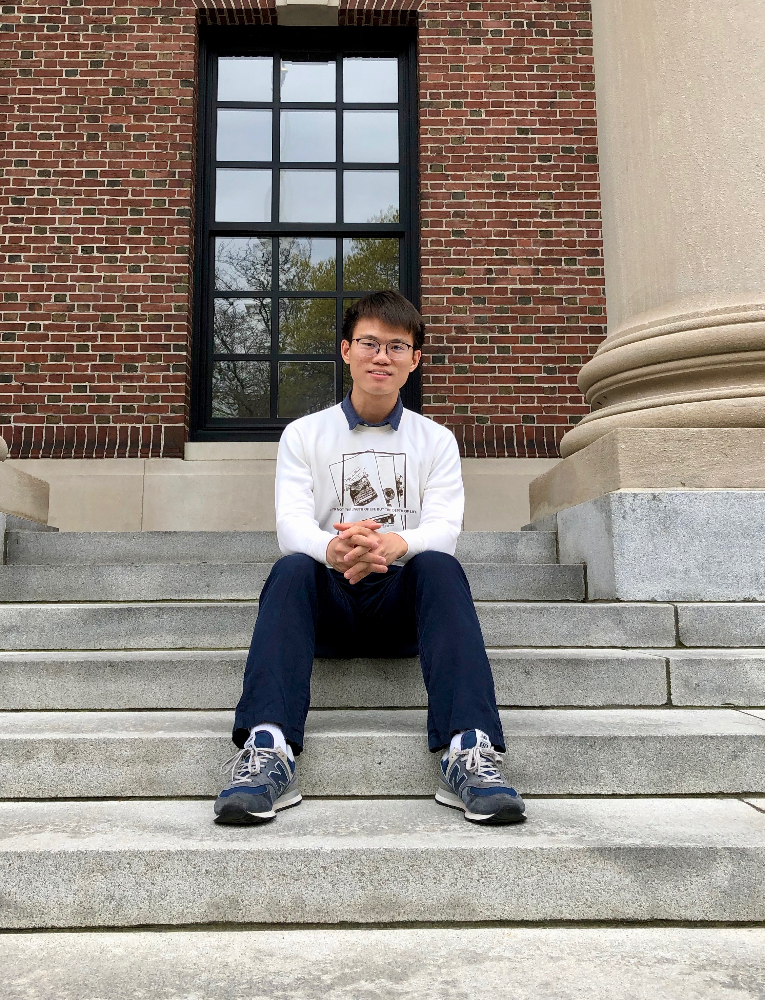

I am a 4th year Ph.D. student in statistics from Harvard University. My research interests include high-dimensional statistics and Bayesian inference. I am especially interested in developing new methodologies for more efficient and stable analyses of the dependence structure in high-dimensional data, which include dimension reduction and variable selection. 
Meanwhile, I enjoy establishing the theoretical guarantees for these new methods with probabilistic tools such as random matrices theories and information theories. 

**Contact**

Science Center 908\\
One Oxford Street\\
Cambridge, MA 02138\\
dhuang01 at g.harvard.edu
